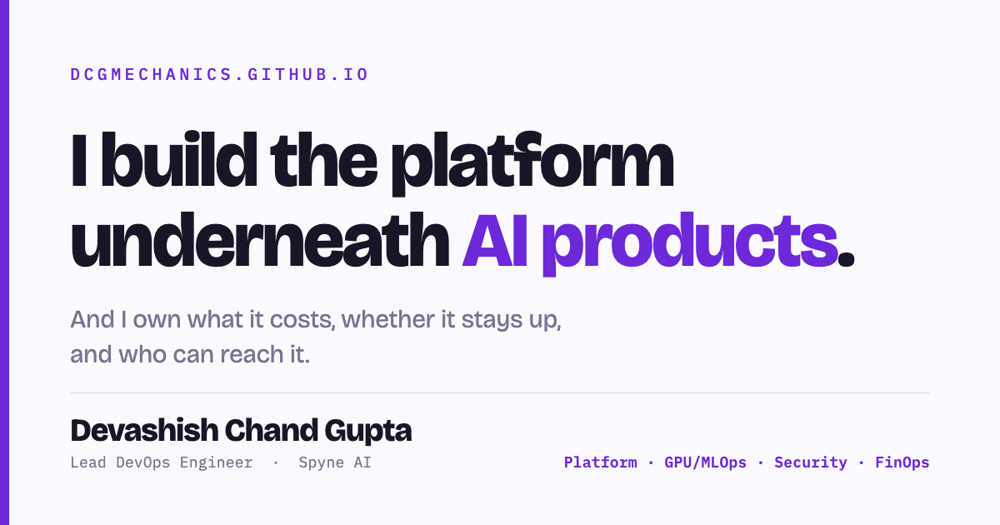

# dcgmechanics.github.io

Personal site — Devashish Chand Gupta, Lead DevOps Engineer.
Live at **https://dcgmechanics.github.io**

One static page. A single HTML file with inline CSS, zero JavaScript, no build
step and no dependencies. Fonts load from Google Fonts; everything else is
self-contained.

## Contents

| File | Purpose |
|---|---|
| `index.html` | The entire site |
| `resume.pdf` | Linked from the Contact section — **the filename is hardcoded, don't rename it** |
| `og.png` | Link-preview card (1200×630) for LinkedIn, Slack, X, iMessage |
| `.nojekyll` | Tells Pages to skip the Jekyll build |

## Link previews

`index.html` carries Open Graph and Twitter Card tags pointing at `og.png`.
Two things to know if you ever change them:

- `og:image` must be an **absolute** URL. A relative path is silently ignored.
- LinkedIn caches previews for about a week. After changing the image or the
  tags, run the URL through **linkedin.com/post-inspector** to force a re-scrape,
  then remove and re-add any Featured entry pointing at it.

## Publishing

Settings → Pages, source `main` / `(root)`. Every push to `main` redeploys;
a build takes about a minute.

## Updating the résumé

Replace `resume.pdf` in place and keep the name. The Contact button points at
`/resume.pdf`, so a renamed file silently 404s — the link still looks fine.

## Editing the page

- **Colour** — the `:root` block at the top. `--violet` for accents, `--credit`
  (deep teal) reserved exclusively for improvement figures in the ledger,
  `--panel` for tinted surfaces. Keeping teal reserved is what makes the ledger
  read as a credit column; using it elsewhere breaks that.
- **Type** — Bricolage Grotesque for display, IBM Plex Sans for body, IBM Plex
  Mono for data and labels. Swapping any of them means editing both the Google
  Fonts `<link>` and the relevant `font-family`.
- **The delta ledger** — the four `.row` elements in the header. Add a fifth and
  give it a matching `animation-delay` so the stagger continues. Rows are visible
  by default and animate only as an enhancement, so the section never renders
  blank if animations don't run.

## What stays off this page

This site is public and indexed permanently. Employer financials and security
specifics are deliberately kept off it:

- Cloud spend appears as ratios and orders of magnitude, never absolute figures.
- Security work is described by method and outcome, not by the weakness it
  addressed.

The résumé is where exact numbers belong — it goes to named recipients, and
specificity is what makes it credible there. Keep the two calibrated differently,
and resist pasting a precise figure back in later because it reads stronger.

## Accessibility and support

- Responsive down to 320px.
- Visible keyboard focus on every interactive element.
- `prefers-reduced-motion` disables the stagger and smooth scrolling.
- No JavaScript, so nothing breaks with scripts blocked.